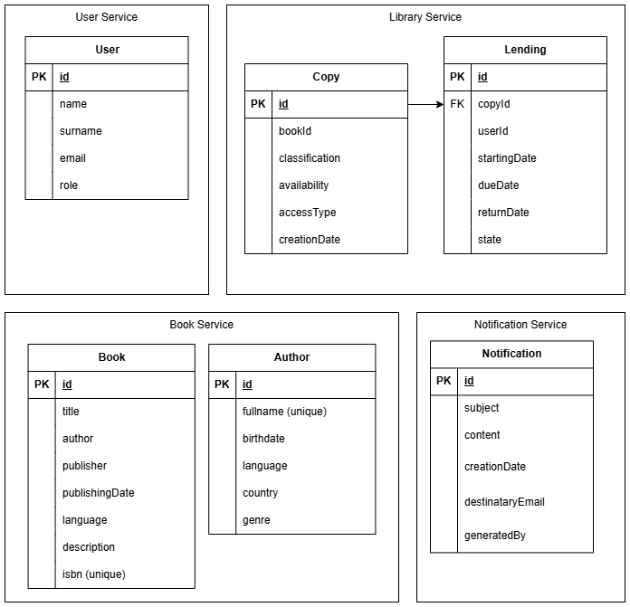

# library-microservices
Library system involving several microservices

## Application Architecture

## Application Entities

## Client Views

### Home

### Register

### Login 

### Book Details

### User Dashboard

### Lending Creation

### Admin Dashboard

### Book Creation

### Lenging Management

